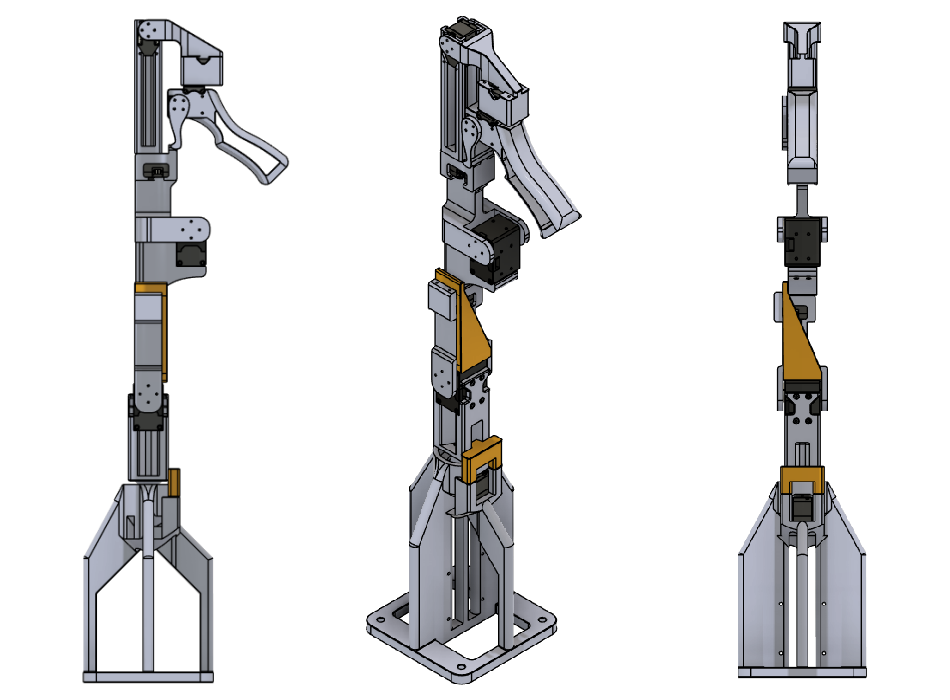

# DIRECT: Durable Intuitive Repeatable Ergonomic Control Device for Robot Teleoperation

DIRECT is an active teleoperation leader arm designed for continuous, large-scale robot data collection with [DROID](https://droid-dataset.github.io/). It serves as a drop-in alternative to VR controllers, offering a more intuitive experience for operators familiar with robot arms.

DIRECT builds on the hardware and software foundations of [FACTR](https://jasonjzliu.com/factr/) and draws mechanical inspiration from [GELLO](https://wuphilipp.github.io/gello_site/). It addresses three pain points encountered during sustained data collection: mechanical failures under continuous use, calibration drift between sessions, and operator fatigue during standing workflows.

> **Credits:**
> - Software and control architecture based on **FACTR** by Jason Jingzhou Liu and Yulong Li.
>   - Teleop software: [github.com/JasonJZLiu/FACTR_Teleop](https://github.com/JasonJZLiu/FACTR_Teleop)
>   - Hardware design: [github.com/JasonJZLiu/FACTR_Hardware](https://github.com/JasonJZLiu/FACTR_Hardware)
> - Mechanical gripper inspiration from **GELLO** by Philipp Wu et al.: [github.com/wuphilipp/gello_mechanical](https://github.com/wuphilipp/gello_mechanical)

---

## DIRECT Design

DIRECT prioritizes three principles for continuous data collection:

### Durability via Servo Shields

Active joint-space controllers that mount servos as load-bearing elements are vulnerable to thread pull-out, where mounting screws tear from the plastic servo housings under continuous use. DIRECT introduces 3D-printed enclosures that absorb and redirect structural loads away from the servos. Mechanical failures observed during testing occurred exclusively on 3D-printed parts, which can be reprinted on demand.

### Repeatability via Deterministic Calibration

Prior puppet-style controllers rely on a visual resting pose for calibration, which can drift between sessions and cause unstable gravity compensation. DIRECT introduces physical calibration fixtures that lock the device joints into a mechanical zero. The physical joint configuration at startup therefore matches the zero pose defined in the URDF, providing consistent initial conditions across episodes.

### Ergonomics for Standing Operation

DIRECT raises the base by 10 cm to extend the operator's reachable configuration space during the standing workflow typical of DROID. It also introduces the **Ergogrip** — a contoured handle inspired by lever-action grips — designed for single-handed standing operation during extended sessions.

### Printability and Sourcing

All structural parts are designed for 3D printing in PETG for improved toughness and temperature resistance. Pre-configured print files with correct part orientations are provided. The design uses standard screws included with the servos and an off-the-shelf metric ball bearing.

### Software Architecture

DIRECT uses a decoupled two-process architecture to integrate into data collection platforms without modifying their codebases. A standalone Python application runs a 500 Hz control loop managing device kinematics and gravity compensation. A lightweight plugin runs alongside the platform GUI, translating device states into joint commands. A de-sync state machine handles reconnection after trajectory resets: each reconnection triggers a smooth PD realignment before active control resumes.

### Force Feedback

Full bi-directional force feedback (as in FACTR) requires a tight control loop at hundreds of Hz between robot and device. Routing this through the DROID GUI (~50 Hz) introduces latency that destabilizes the loop. DIRECT therefore does not implement force feedback in this release. Instead, a local virtual spring on the device trigger provides passive resistance for grip comfort.

---

## Hardware

> **Assembly guide:** DIRECT does not yet have its own assembly documentation. Follow the **[FACTR Hardware assembly guide](https://github.com/JasonJZLiu/FACTR_Hardware)** (core arm structure, servo wiring, and BOM). The DIRECT-specific printed parts are drop-in additions that are self-explanatory once you have the base arm assembled.

DIRECT-specific parts are available in `hardware/`:
- **`hardware/step/`** — STEP (`.step`) source CAD files, for import into any CAD tool
- **`hardware/3mf/`** — 3MF (`.3mf`) print files pre-configured in **PrusaSlicer** with correct part orientations, supports, and material settings

Parts included:
- Servo shield enclosures — redirect structural loads away from servo housings
- Calibration fixtures (base wedge + joint wedge + trigger dock) — lock joints into mechanical zero
- Elevated base (+10 cm) — extends the operator's reachable configuration space
- Ergogrip handle — contoured for single-handed standing operation

All DIRECT parts are designed for **PETG** (recommended over PLA for toughness and temperature resistance). Pre-configured print orientations are included in the 3MF files. The design uses M2/M3 screws (included with the servos) and one standard metric ball bearing.

> **Important — weigh links before assembly:** `direct.urdf` encodes the mass and inertia of each link *with its servo already installed*. Weigh each printed link after inserting its servo (and any heat-set inserts/bearings) but *before* attaching it to the arm chain. Update the corresponding `<mass value="..."/>` entries in the URDF to match your measured values. Accurate link masses are critical for stable gravity compensation.
>
> **Note on URDF provenance:** The mass and inertia parameters in `direct.urdf` are taken directly from the FACTR project and have **not** been re-measured or recalculated for DIRECT. This means gravity compensation may exhibit some residual drift even after accurate mechanical calibration. If you require tighter gravity compensation, re-identify the link inertial parameters for your specific assembly.

---

## First Time Installation Guide

### Hardware Setup

- Follow the [FACTR Hardware assembly guide](https://github.com/JasonJZLiu/FACTR_Hardware) to build the base arm, then add the DIRECT-specific printed parts.
- Install DIRECT onto your DROID portable setup (power sources, USB, mounting via clamps/screws, cable management).
- Verify the device powers on and servos respond before proceeding.

### Software Setup — DROID's Data Collection Laptop

> Requires DROID to already be installed. If not, follow [droid-dataset.github.io](https://droid-dataset.github.io/) first.

Create a dedicated Conda environment with Python 3.10 to avoid dependency conflicts with the DROID GUI environment:

```bash
conda create -n teleop_direct python=3.10
conda activate teleop_direct
```

Follow the [Dynamixel servo setup guide](./src/direct/README.md) to configure servo IDs, baud rates, and USB latency.

Install [Pinocchio](https://stack-of-tasks.github.io/pinocchio/download.html) and then clone and install this package at the same level as the DROID repository:

```bash
conda activate teleop_direct
cd <path_to_repo_root>/DIRECT
pip install -e .
```

---

## Testing Before Using with DROID

Make sure the DIRECT device is powered on and connected to your laptop via USB.

```bash
conda activate teleop_direct
python DIRECT/scripts/run_direct.py --calib  # required on first run or after re-powering servos
```

This launches the DIRECT control loop and connects to the device. Follow the terminal prompts to calibrate. This process must be launched **before** the DROID GUI.

---

# Usage with DROID GUI — Teleoperator's Guide

## DIRECT Hardware Setup

- Plug DIRECT into the power outlet (white cable).
- Turn ON the switch on the blue Servo Control Board (mounted to the base of DIRECT). A red LED should illuminate, indicating servos are powered.
- Plug the Micro-USB cable from the PC into the Servo Control Board (U2D2 converter). A second red LED inside the box should illuminate, indicating USB connection.

## DIRECT Calibration

Before starting the DROID GUI, DIRECT must be calibrated. Insert the calibration fixtures to lock the device into its mechanical zero position, which corresponds to the Franka Emika Panda robot arm zero pose.

The compound figure below shows the device fully assembled with all calibration fixtures inserted, from three angles:



> **Wrist camera:** The wrist-mounted camera mounts on the **side of the Ergogrip handle**. Ensure it is attached before calibrating so its cable routing does not shift the device out of the locked position.

Fixtures to insert before calibrating:
- **Base wedge** (black) — locks the base joint
- **Joint wedge** (orange) — inserted between links to lock the mid-chain joints
- **Trigger dock** — trigger rested against the notch on link 4 (small white arrow marker)

Open the 1st terminal and run:

```bash
conda activate teleop_direct
python DIRECT/scripts/run_direct.py --calib  # IMPORTANT: --calib is required every time servo power is cycled
```

The script will exit with an error if the USB latency timer is not set. Follow the printed instruction to fix it (needs `sudo`):

```bash
echo 1 | sudo tee /sys/bus/usb-serial/devices/ttyUSB0/latency_timer
```

Run the calibration command again after setting the timer. This is required every time servo power is cycled.

Calibration procedure:
1. Insert the calibration fixtures as shown above — this locks the device into its mechanical zero.
2. Press **Enter** at the first prompt. Remove the calibration fixtures.
3. At the second prompt you set the null-space (redundancy resolution) target. Position the device where desired, then press **Enter**. DIRECT will automatically hold this configuration when redundancy is available.

The calibration is saved to a `.npy` file beside the config. On subsequent runs without `--calib`, the saved calibration is loaded automatically (as long as servo power was not cycled).

## After Calibration — Starting the Control Loop

DIRECT will enter gravity compensation mode automatically after calibration. Leave this terminal running.

To start in a subsequent session (servo power not cycled):

```bash
conda activate teleop_direct
python DIRECT/scripts/run_direct.py
```

---

## Dry-Run — Test DIRECT Without the Robot

Before launching the full DROID GUI (which sends live commands to the Franka), you can dry-run the policy to verify DIRECT is communicating correctly and the policy initialises without errors:

```bash
conda activate teleop_direct
python DIRECT/scripts/debug_direct_policy.py
```

This script initialises `DIRECTTeleopPolicy` and loops `policy.forward()` at 10 Hz using a fixed observation set to the DROID Franka rest pose. No robot connection is required. Use it to confirm ZMQ addresses, keyboard handling, and policy state logic before risking live hardware.

---

## Running DROID GUI with DIRECT

Pre-flight checklist:

- Franka robot is powered on (yellow), unlocked (white button glowing blue), and in FCI mode.
- Robot is connected to the Polymetis Control Robot PC.
- All ZED cameras are powered and connected to the Data Collection PC.
- DIRECT control loop is running in the 1st terminal (step above).
- ChArUco calibration board is ready for the DROID camera calibration procedure.

Open a 2nd terminal for the DROID GUI:

```bash
conda activate teleop_droid
python DIRECT/scripts/main.py --direct
```

### Keyboard Controls

| Key | Action |
|-----|--------|
| `F5` | Toggle all inputs ON/OFF (lock-out to prevent accidental commands) |
| `A` | Pulse success signal |
| `B` | Pulse failure signal |
| `M` | Toggle movement ON/OFF — enables/disables sending joint commands to robot |
| `N` | Set null-space target to current device position |
| `V` | Toggle torque visualisation |
| `F` | Cycle feedback mode (OFF → ALIGNED_TORQUE) |
| `Shift` | Toggle camera views in DROID GUI |

**When enabling movement (`M`):** DIRECT first syncs to the robot's current position. Do not resist — let it settle before moving. You will feel the device actively move to match the robot; wait until it stops before starting teleoperation.

**When setting null-space (`N`):** DIRECT will automatically drift toward this joint configuration whenever redundancy is available (without moving the end-effector).

### Recording Trajectories

1. Make sure **movement is disabled** first.
2. Press `A` to start recording. Wait for camera feeds and the robot to reach its start position.
3. After camera feeds appear, press `M` to enable movement and begin teleoperation.

---

## Known Issues and Planned Improvements

### Known Issues

- Sync via `M` key can occasionally be unreliable in the DROID GUI — under investigation.
- No end-effector safety workspace — the robot can reach itself or surrounding objects.
- Gripper virtual spring can bounce at the end of its range of motion.

### Planned Improvements

- Force feedback: detect external joint torques on the robot and relay them to the device (framework is present, tuning required).
- End-effector safety bounding box via IK on the DIRECT side.

